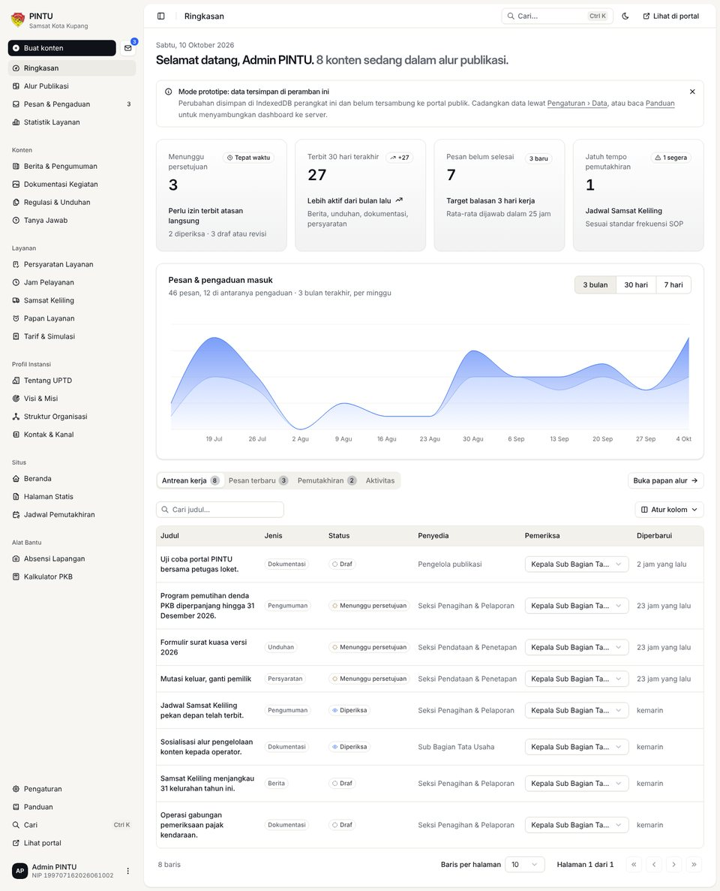

# PINTU — Portal Informasi dan Pelayanan

Prototipe UI/UX, design system, dan dashboard pengelolaan konten website profil dan pelayanan informasi **UPTD Pendapatan Daerah Wilayah Kota Kupang (Samsat Kota Kupang)**, Provinsi Nusa Tenggara Timur.

Disusun dari *Rancangan Aktualisasi* "Penyediaan Website Profil dan Pelayanan Informasi melalui PINTU". Analisa lengkap, sitemap, design system, dan tata kelola konten ada di [`docs/RANCANGAN-UIUX.md`](docs/RANCANGAN-UIUX.md).

## Pratinjau

| Beranda | Dashboard pengelolaan konten |
|---|---|
|  |  |

Tangkapan layar lain ada di [`docs/preview/`](docs/preview/).

## Halaman

| Publik | Internal & panduan |
|---|---|
| `index.html` — Beranda (landing profil) | `login.html` — Login pegawai |
| `profil.html` — Tentang UPTD | `dashboard/` — Dashboard pengelolaan konten |
| `visi-misi.html` — Visi, misi, nilai, maklumat | `design-system.html` — Panduan design system |
| `struktur-organisasi.html` — Bagan & uraian tugas | `kebijakan-privasi.html`, `syarat-ketentuan.html` |
| `layanan.html` — Persyaratan, alur non-tunai, simulasi PKB | `404.html` |
| `jadwal.html` — Jam loket & Samsat Keliling | `dashboard-pegawai.html` — pengalih ke `dashboard/` |
| `informasi.html`, `berita-detail.html` — Berita & pengumuman | |
| `dokumentasi.html` — Galeri kegiatan | |
| `unduhan.html` — Regulasi & formulir | |
| `kontak.html` — Kontak, peta, masukan, pengaduan | |

## Menjalankan

Portal publik tidak perlu build. Jalankan server statis dari root repo, lalu buka `http://localhost:8080`:

```bash
npx http-server .
```

Dashboard (`/dashboard/`) memakai modul JavaScript sehingga harus dibuka lewat server, bukan langsung dari berkas. Untuk mengembangkan dashboard, lihat [`dashboard-app/README.md`](dashboard-app/README.md).

## Dashboard pengelolaan konten

Folder `dashboard/` berisi aplikasi dashboard untuk mengelola seluruh konten portal: berita & pengumuman, dokumentasi, regulasi & unduhan, tanya jawab, persyaratan layanan, jam pelayanan, Samsat Keliling, papan layanan, tarif simulasi, statistik, profil, visi misi, struktur organisasi, kontak, beranda, halaman statis, jadwal pemutakhiran, serta pesan & pengaduan. Konten melewati alur publikasi **draf → diperiksa → menunggu persetujuan → terbit** sesuai rancangan. Ada juga alat bantu petugas: **absensi lapangan** (foto + GPS) dan **kalkulator PKB** dengan mode amnesti.

Masuk lewat **Login Pegawai** (`login.html`) dengan akun prototipe:

| NIP | Kata sandi |
|---|---|
| `199707162026061002` | `password123` |

Dashboard dibangun dengan React, TypeScript, Tailwind CSS, dan shadcn/ui (template *dashboard-01*). Kode sumbernya di [`dashboard-app/`](dashboard-app/); hasil build di `dashboard/` sudah ikut di repo sehingga bisa langsung dibuka dari server statis. Data disimpan di IndexedDB peramban sampai dashboard disambungkan ke REST API. Panduan pengembangan, model data, dan kontrak API ada di [`dashboard-app/README.md`](dashboard-app/README.md).

> Akun statis diperiksa di peramban dan **tidak aman untuk produksi**. Pindahkan login ke server sebelum portal dipakai publik.

## Mengubah header, footer, atau ikon

Sumber tunggalnya ada di `partials/`. Setelah mengedit, salin ke semua halaman:

```bash
node scripts/sync-partials.mjs
```

## Konten dinamis

Jam loket, rotasi Samsat Keliling, dan parameter simulasi PKB ada di objek `CONFIG` pada `assets/js/main.js`. Semua konten ini juga sudah dimodelkan di dashboard; langkah berikutnya adalah membaca isi portal dari API yang sama dengan dashboard. Semua nilai yang ditandai titik kuning di halaman adalah **data contoh** dan wajib diverifikasi petugas sebelum terbit (daftar lengkap di §10 dokumen rancangan).

## Logo

Logo utama adalah **Lambang Provinsi Nusa Tenggara Timur** (`assets/img/lambang-ntt.png` dan turunan `lambang-ntt-*.webp`). Aturan pemakaian ada di seksi *Logo & lambang* pada `design-system.html`.

Logo PINTU (pintu terbuka) **disimpan sebagai logo cadangan** dan tidak tampil saat ini: simbol `#logo-pintu` di `partials/icons.html`, berkas `assets/img/logo-pintu.svg` dan `assets/img/favicon.svg`. Untuk memakainya lagi di navbar, lihat komentar di `partials/header.html`.

## Tipografi

Situs memakai **SF Pro Display** (headline dan angka besar) dan **SF Pro Text** (isi dan UI) sebagai font sistem. Berkas font tidak disertakan di repo karena lisensi Apple tidak mengizinkan distribusi lewat web. Perangkat Apple menampilkan SF Pro, sedangkan perangkat lain otomatis memakai font sistemnya (Segoe UI di Windows, Roboto di Android). Token ada di `assets/css/tokens.css` (`--font-display`, `--font-sans`).

Gambar di `docs/preview/` dirender di server Linux tanpa SF Pro, memakai Inter sebagai pengganti terdekat.

## Lisensi aset

Lambang Provinsi NTT adalah milik Pemerintah Provinsi NTT dan dipakai sesuai ketentuan lambang daerah.
