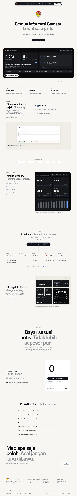
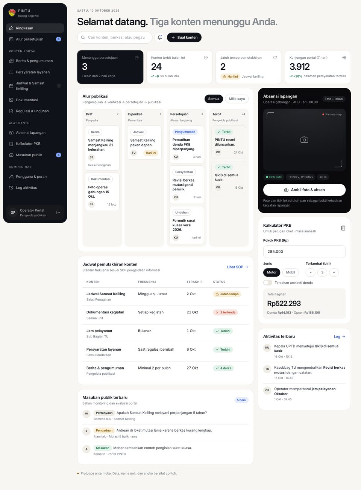

# PINTU — Portal Informasi dan Pelayanan

Prototipe UI/UX dan design system website profil dan pelayanan informasi **UPTD Pendapatan Daerah Wilayah Kota Kupang (Samsat Kota Kupang)**, Provinsi Nusa Tenggara Timur.

Disusun dari *Rancangan Aktualisasi* "Penyediaan Website Profil dan Pelayanan Informasi melalui PINTU". Analisa lengkap, sitemap, design system, dan tata kelola konten ada di [`docs/RANCANGAN-UIUX.md`](docs/RANCANGAN-UIUX.md).

## Pratinjau

| Beranda | Ruang pegawai |
|---|---|
|  |  |

Tangkapan layar lain ada di [`docs/preview/`](docs/preview/).

## Halaman

| Publik | Internal & panduan |
|---|---|
| `index.html` — Beranda (landing profil) | `login.html` — Masuk pegawai |
| `profil.html` — Tentang UPTD | `dashboard-pegawai.html` — Ruang pegawai |
| `visi-misi.html` — Visi, misi, nilai, maklumat | `design-system.html` — Panduan design system |
| `struktur-organisasi.html` — Bagan & uraian tugas | `kebijakan-privasi.html`, `syarat-ketentuan.html` |
| `layanan.html` — Persyaratan, alur non-tunai, simulasi PKB | `404.html` |
| `jadwal.html` — Jam loket & Samsat Keliling | |
| `informasi.html`, `berita-detail.html` — Berita & pengumuman | |
| `dokumentasi.html` — Galeri kegiatan | |
| `unduhan.html` — Regulasi & formulir | |
| `kontak.html` — Kontak, peta, masukan, pengaduan | |

## Menjalankan

Tidak perlu build. Buka `index.html` di peramban, atau jalankan server statis:

```bash
npx http-server .
```

## Mengubah header, footer, atau ikon

Sumber tunggalnya ada di `partials/`. Setelah mengedit, salin ke semua halaman:

```bash
node scripts/sync-partials.mjs
```

## Konten dinamis

Jam loket, rotasi Samsat Keliling, dan parameter simulasi PKB ada di objek `CONFIG` pada `assets/js/main.js`. Semua nilai yang ditandai titik kuning di halaman adalah **data contoh** dan wajib diverifikasi petugas sebelum terbit (daftar lengkap di §10 dokumen rancangan).

## Logo

Logo utama adalah **Lambang Provinsi Nusa Tenggara Timur** (`assets/img/lambang-ntt.png` dan turunan `lambang-ntt-*.webp`). Aturan pemakaian ada di seksi *Logo & lambang* pada `design-system.html`.

Logo PINTU (pintu terbuka) **disimpan sebagai logo cadangan** dan tidak tampil saat ini: simbol `#logo-pintu` di `partials/icons.html`, berkas `assets/img/logo-pintu.svg` dan `assets/img/favicon.svg`. Untuk memakainya lagi di navbar, lihat komentar di `partials/header.html`.

## Lisensi aset

Font Instrument Serif dan Geist dilisensikan SIL Open Font License (lihat `assets/fonts/`). Lambang Provinsi NTT adalah milik Pemerintah Provinsi NTT dan dipakai sesuai ketentuan lambang daerah.
